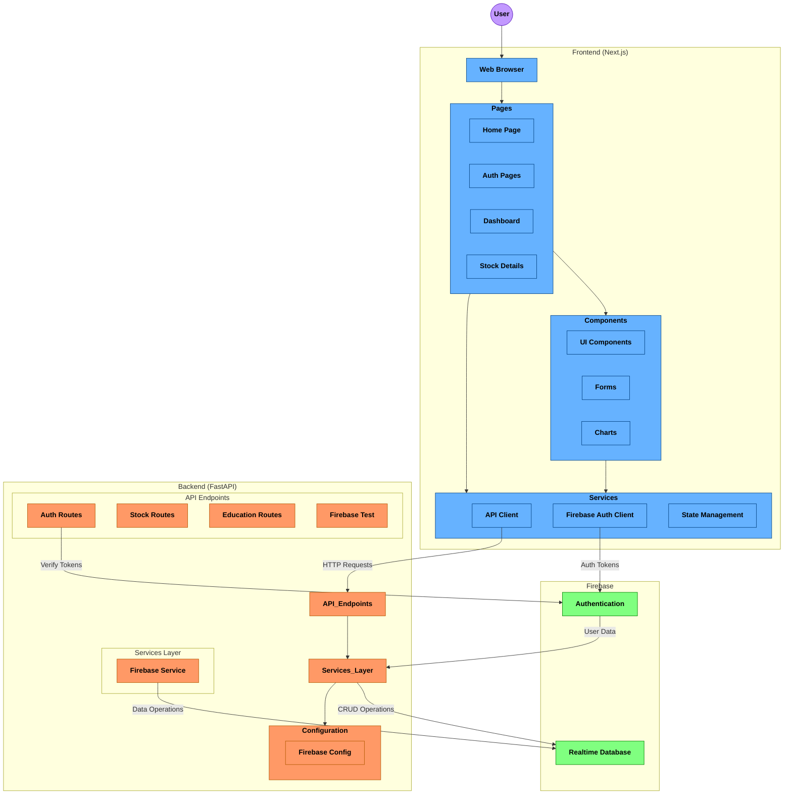
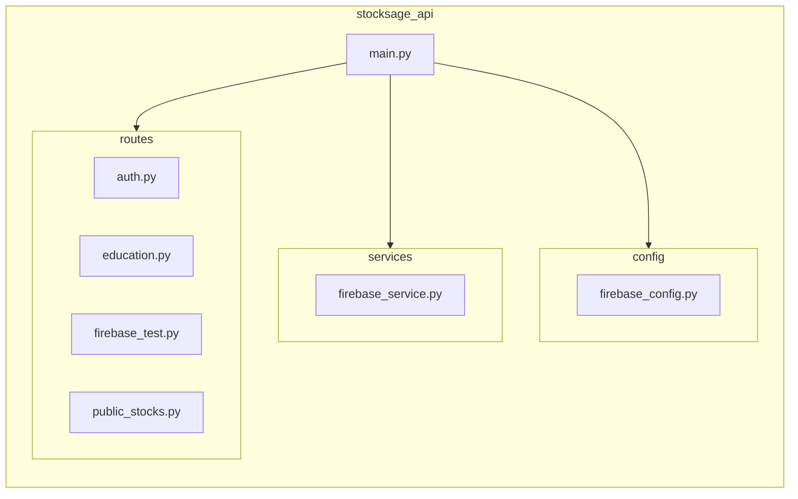
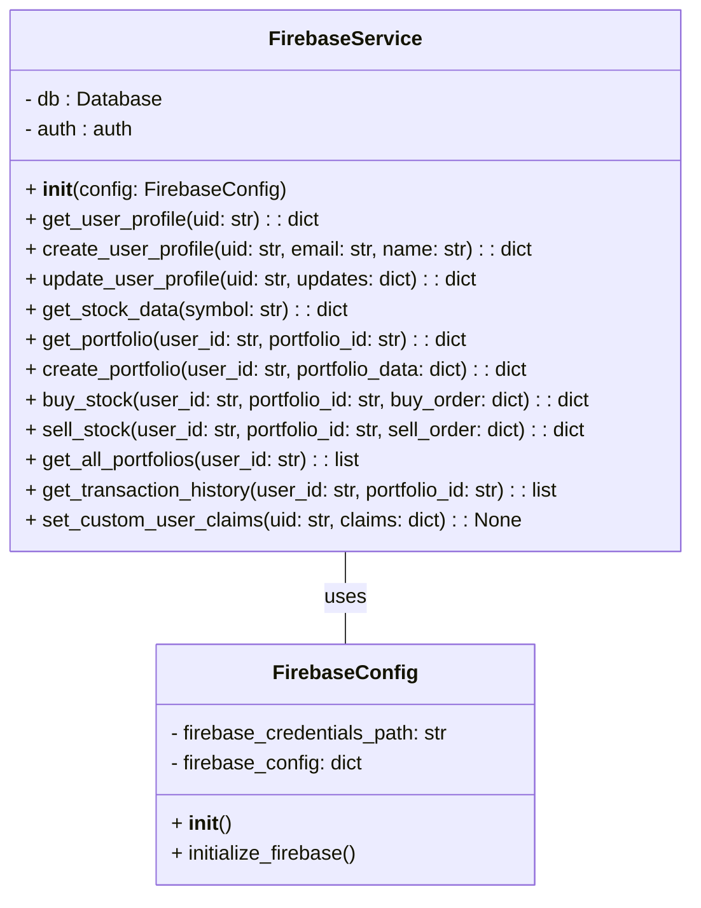
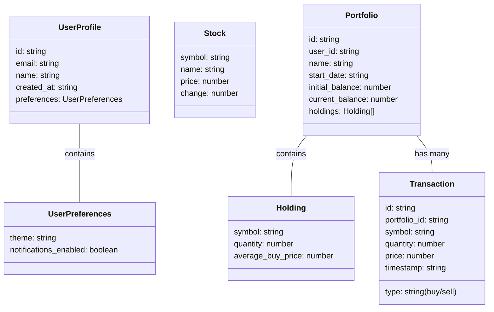
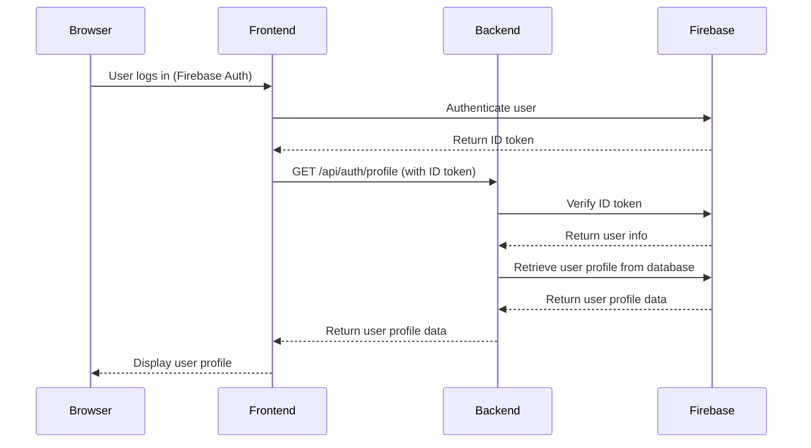

# StockSage-AI System Design

This document outlines the system design for the StockSage-AI, which is built using FastAPI backend and NextJS frontend.

## 1. Architecture Overview

StockSage-AI follows a modern web application architecture with clear separation between frontend and backend components, communicating through well-defined API endpoints. Firebase provides authentication and data storage services.

### System Components

*   **Frontend (Next.js):** 
    * UI components built with React and TypeScript
    * Authentication flows using Firebase Authentication
    * API client that handles token management and typed requests
    * Responsive dashboard for portfolio management and stock tracking

*   **Backend (FastAPI):** 
    * RESTful API endpoints handling business logic
    * Firebase integration for data persistence
    * Authentication validation using Firebase Admin SDK
    * Stock data processing and educational content delivery

*   **Firebase:**
    * User authentication and management
    * Realtime Database for storing portfolios, stocks, and transactions
    * Security rules governing data access



This architecture provides several key benefits:

1. **Separation of Concerns:** Frontend and backend have clear responsibilities, making the system easier to maintain and extend.
2. **Type Safety:** Using TypeScript in the frontend and Pydantic models in the backend ensures consistent data structures.
3. **Authentication Flow:** Firebase handles user authentication, with token verification on the backend for secure API access.
4. **Scalability:** Components can be scaled independently as needed.
5. **Real-time Capabilities:** Firebase Realtime Database enables real-time updates for stock prices and portfolio values.

## 2. Package Structure

The `stocksage_api` package is organized as follows:

```
stocksage_api/
├── config/
│   ├── firebase_config.py  # Firebase initialization and configuration
│   └── __init__.py
├── services/
│   ├── firebase_service.py  # Logic for interacting with Firebase
│   └── __init__.py
├── routes/
│   ├── auth.py             # Authentication routes
│   ├── education.py        # Routes for educational content
│   ├── firebase_test.py    # Firebase connection test routes
│   ├── public_stocks.py    # Public stock data routes
│   └── __init__.py
├── main.py                 # FastAPI application entry point
└── __init__.py
```



## 3. Class Relationships (Inferred from Code)

Since you are using FastAPI, the data models are primarily defined implicitly through Pydantic models within your route handlers and service functions. There aren't explicit class definitions in the traditional object-oriented sense for many parts of the application. However, we can represent the key data structures and their relationships. The `firebase_service.py` file contains the most significant class-like structure.



**Key Data Structures (Inferred from API Specification and Code):**

These are represented as conceptual classes, reflecting how they're used in the API.



## 4. Data Flow: Example (User Authentication and Profile Retrieval)

This sequence diagram illustrates the flow for a user logging in and retrieving their profile:



## 5. Error Handling

The backend uses standard HTTP status codes to indicate errors:

*   **400 Bad Request:** Invalid input data.
*   **401 Unauthorized:** Invalid or missing authentication token.
*   **403 Forbidden:** User does not have permission to access the resource.
*   **404 Not Found:** Resource not found.
*   **500 Internal Server Error:**  Server-side error.

Error responses typically include a JSON body with details about the error.

## 6. System Environment and Dependencies

### Hardware and Operating System Requirements
* The application is designed to run on any modern operating system that supports the required software dependencies
* No specific hardware requirements beyond what's needed to run the development tools

### Software Dependencies

#### Backend Requirements
* **Python:** Version 3.12 or higher
* **Poetry:** For Python dependency management (recommended)
* **Firebase:** Project with Realtime Database
* **Key Python Packages:**
  * **FastAPI:** Web framework for building APIs
  * **Firebase Admin SDK:** Server-side Firebase integration (authentication, database)
  * **Pyrebase4:** Client-side Firebase integration (real-time database)
  * **python-dotenv:** Loads environment variables
  * **Uvicorn:** ASGI server for running FastAPI
  * **Pydantic:** Data validation and settings management

#### Frontend Requirements
* **Node.js:** Version 16 or higher
* **npm or yarn:** For package management
* **Key JavaScript/TypeScript Packages:**
  * **Next.js:** React framework for production
  * **React:** UI component library
  * **TypeScript:** Type-safe JavaScript
  * **Firebase JS SDK:** Client-side Firebase integration
  * **Tailwind CSS:** Utility-first CSS framework

### Configuration Requirements

#### Firebase Setup
* Firebase project with Authentication and Realtime Database enabled
* Firebase service account credentials (private key JSON file)
* Environment variables properly configured:
  * Backend: `.env` file based on `.env.example` template
  * Frontend: `.env.local` file with Firebase configuration

#### Environment Variables Structure
* **Backend Environment Variables:**
  ```
    # Firebase Service Account - REQUIRED
    # Path to your Firebase service account credentials file (JSON)
    GOOGLE_APPLICATION_CREDENTIALS=C:\path\to\your-firebase-credentials.json

    # Firebase Configuration - REQUIRED
    FIREBASE_DATABASE_URL=https://your-project-id-default-rtdb.firebaseio.com
    FIREBASE_PROJECT_ID=your-project-id
    FIREBASE_API_KEY=your-api-key-here
    FIREBASE_AUTH_DOMAIN=your-project-id.firebaseapp.com
    FIREBASE_STORAGE_BUCKET=your-project-id.firebasestorage.app
    FIREBASE_MESSAGING_SENDER_ID=your-messaging-sender-id
    FIREBASE_APP_ID=your-app-id
    FIREBASE_MEASUREMENT_ID=your-measurement-id
  ```

* **Frontend Environment Variables:**
  ```
  NEXT_PUBLIC_FIREBASE_API_KEY=your-api-key
  NEXT_PUBLIC_FIREBASE_AUTH_DOMAIN=your-project-id.firebaseapp.com
  NEXT_PUBLIC_FIREBASE_PROJECT_ID=your-project-id
  NEXT_PUBLIC_FIREBASE_DATABASE_URL=https://your-project-id.firebaseio.com
  NEXT_PUBLIC_FIREBASE_STORAGE_BUCKET=your-project-id.appspot.com
  NEXT_PUBLIC_FIREBASE_MESSAGING_SENDER_ID=your-messaging-sender-id
  NEXT_PUBLIC_FIREBASE_APP_ID=your-app-id
  NEXT_PUBLIC_API_URL=http://localhost:8000
  ```

### Network Configuration
* Backend API server runs on `http://localhost:8000` by default
* Frontend development server runs on `http://localhost:3000` by default
* CORS is configured on the backend to allow requests from the frontend
* Internet connection required for Firebase services

### Authentication and Security Considerations
* Firebase Authentication handles user registration, login, and token management
* Backend verifies Firebase ID tokens for protected API endpoints
* Tokens expire after 1 hour and require automatic refresh
* API requests must include the token in the Authorization header (Bearer format)

### Database Configuration
* Firebase Realtime Database is used for data persistence
* The database structure follows the data models outlined in the API specification
* Security rules in Firebase control access to data based on user authentication

This document provides a high-level overview of the StockSage-AI system design. It can be further expanded with more detailed sequence diagrams for specific API endpoints and more comprehensive class diagrams as the codebase evolves.
